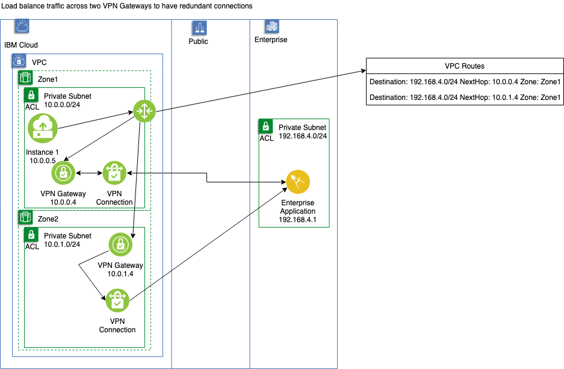
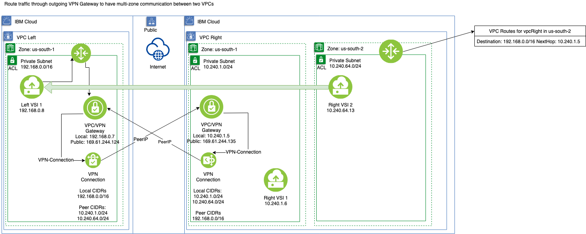

---

copyright:
  years: 2019
lastupdated: "2019-08-02"

keywords: vpc, secure, region, zone, subnet, routing, terminology, public gateway, floating IP, NAT, API

subcollection: vpc-on-classic-network

---

{:shortdesc: .shortdesc}
{:new_window: target="_blank"}
{:codeblock: .codeblock}
{:pre: .pre}
{:screen: .screen}
{:tip: .tip}
{:note: .note}
{:important: .important}
{:download: .download}
{:DomainName: data-hd-keyref="DomainName"}

# Setting Up Advanced Routing in VPC

The {{site.data.keyword.vpc_short}} [Routes API](https://{DomainName}/apidocs/vpc-on-classic#create-a-route-on-your-vpc) allows you to control the flow of network traffic in your VPC.  It allows you to specify the next hop for packets, filtered by their destination addresses.

## Routing structure

In the network structure of a VPC, one route table exists for each zone used by a VPC in a region. When an IP packet leaves a subnet, it is evaluated against the route table in the subnet's zone, to determine where to send the packet next. Each router has a default route, but the VPC Routes API allows you to provide custom static routes to your routing tables.

## VPC Route structure and behavior

A VPC Route has three main components: the destination CIDR, the next hop, and the zone. The traffic that originates in a VPC in the zone whose destination address falls within the destination CIDR will be routed to the next hop. However, if the destination address falls within the destination CIDR for two routes, the most specific one will apply. Furthermore, if there are two or more, equally specific routes, the traffic will be round-robin distributed across each of the route's next hop.

## Use cases

### Load balance traffic across two VPN Gateways to create redundant connections

The figure that follows shows an instance running in IBM Cloud VPC in `Zone1`, where it sends a message to the enterprise application on a private subnet. A redundant connection exists from the IBM Cloud VPC to the enterprise private subnet. The router for the VPC in `Zone1` is configured with two VPC Routes that both have equally specific destinations, but different `next_hops`.  Traffic in this situation will be round-robin distributed across both zones.

### Route traffic back through an outgoing VPN gateway to create bi-directional communication between two VPCs

The figure that follows shows how we've addressed a previous limitation. With a VPN connection between 2 VPCs, one could not send traffic from one zone within a VPC through a VPN in another zone to another VPC. By adding a VPC Route to the VPC in zone `us-south-2`, we are able to route traffic from `us-south-2` to `us-south-1` through the VPN to the destination VSI.

The encrypted traffic between the VPC Gateways traverses the public Internet
and will incur charges.
{: note}

## Limitations

1. Currently, the ability to set a custom default static route is not available.  Only non-default static routes are supported.
2. You may only set the `next_hop` to be an `ip_address`. Today, you cannot set the `next_hop` to be a VPN connection or a load balancer.
