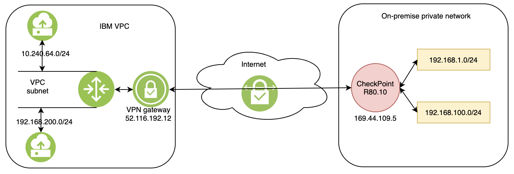

---

copyright:
  years: 2020
lastupdated: "2020-03-10"

keywords: peering, Check Point, Security Gateway, connection, secure, remote, vpc, vpc network

subcollection: vpc-on-classic-network

---

{:shortdesc: .shortdesc}
{:codeblock: .codeblock}
{:screen: .screen}
{:new_window: target="_blank"}
{:pre: .pre}
{:tip: .tip}
{:important: .important}
{:table: .aria-labeledby="caption"}
{:download: .download}
{:note: .note}
{:DomainName: data-hd-keyref="DomainName"}

# Creating a secure connection with a remote Check Point Security Gateway peer
{: #conn-checkpoint-peer}

You can connect a Check Point Security Gateway peer to a VPN gateway in an existing {{site.data.keyword.cloud}} Virtual Private Cloud (VPC).
{: shortdesc}

These examples are based on Check Point Security Gateway, Software Release [R80.10].
{: note}

## Topology
{: #checkpoint-architecture}

The following diagram shows a VPN gateway in an IBM Cloud VPC connecting to a Check Point Security Gateway peer.

## Configuring the Check Point Security Gateway peer
{: #create-conn-checkpoint-peer}

Check Point Security Gateway uses IKEv1 by default, you must create a custom [IKE](#custom-ike-policy-with-cp) and [IPsec](#custom-ipsec-policy-with-cp) policy to replace the default policy for the VPN in your VPC. 

The following parameters are used in the Check Point Security Gateway’s example VPN configuration. Update the values as you see fit.
{: #VPN-Parameters}

|   Parameters     | Value |
| ------- | ------ |
| IKE version | IKEv1|    
| IKE policy | AES256-SHA1-Group2 |
| IPsec policy | AES128-SHA1 |
| IKE lifetime | 1440 minutes |
| IPsec lifetime | 3600 seconds |
| DPD | dpd action is restart |
{: caption="Table 1. VPN parameters" caption-side="top"}

**To support these functions, the following general configuration steps must be performed by the Check Point Security Gateway:**

1. Configure the Security Gateways that are internally managed
  * Go to **SmartConsole\>Securitys & Services** and click on the name of Security Gateway to open the Security Gateway configuration page.
  * Go to **Network Management** page to define the Topology.
  * Go to **Network Management \> VPN Domain** to define the VPN Domain.
2. Create an `Interoperable Device` on the Check Point SmartConsole
  * Go to Object Explorer and click **New \> Network Object \> More \> Interoperable Device** to open the new interoperable page.
  * In the **General Properties** page, enter IBM VPN gateway name and public IP address.
  * Go to **Topology page**, add IBM VPN gateway public IP address and IBM VPC subnets. The IBM VPN public IP address should be added as external network with netmask `255.255.255.255`. The IBM VPC subnets should be added as internal network.
3. Add VPN Community, the instructions below are based on that a `Star Community` was chosen, but a `Meshed Community` is an option as well.
  * Go to **SmartConsole \> Security Policies \> Access Tools \> VPN Communities** and click on `Star Community` to open the new VPN community page.
  * Enter the new Community name.
  * Go to **Gateways \> Center Gateways** page, click the `+` icon and add Check Point Security Gateway.
  * Go to **Gateways \> Satellite Gateways** page, click the `+` icon and add the IBM VPN gateway.
  * Go to **Encryption** page, use default `Encryption Method` and `Encryption Suite`.
  * Go to **Tunnel Management** page, select `One VPN tunnel per subnet pair`.
  * Go to **Shared Secret page**, set the pre-share key.
  * Click OK and publish the changes.
4. Add relevant access rules in the Security Policy
  * Add the Community in the VPN column, the services in the Service & Applications column, the desired Action, and the appropriate Track option.
  * Install the Access Control Policy.

### Creating a custom IKE policy for Check Point Security Gateway
{: #custom-ike-policy-with-cp}

By default, Check Point Security Gateway uses IKEv1, therefore, you must create a custom IKE policy to replace the default policy for the VPN in your VPC.

To use a custom IKE policy in VPN for VPC:
1. On the VPN for VPC page in the IBM Cloud console, select the **IKE policies** tab.
2. Click **New IKE policy** and specify the following values:
  * For the **IKE Version** field, select **1**.
  * For the **Authentication** field, select **sha1**.
  * For the **Encryption** field, select **aes256**.
  * For the **DH Group** field, select **2**.
  * For the **Key lifetime** field, specify **86400**.
3. When you create the VPN connection in your VPC, select this custom IKE policy.

### Creating a custom IPsec policy for Check Point Security Gateway
{: #custom-ipsec-policy-with-cp}

To use a custom IPsec policy in VPN for VPC:
1. On the VPN for VPC page in the IBM Cloud console, select the **IPsec policies** tab.
2. Click **New IPsec policy** and specify the following values:
  * For the **Authentication** field, select **sha1**.
  * For the **Encryption** field, select **aes128**.
  * For the **Key lifetime** field, specify **3600**.
3. When you create the VPN connection in your VPC, select this custom IPsec policy.

## Checking the status of the secure connection
{: #check-cp-conn-status}

You can check the status of your connection in the {{site.data.keyword.cloud_notm}} console. On the VPN for VPC page, select your VPN gateway and click **Connections** from the navigation pane on the left side of the page.

You can also test the connection by doing a ping from a virtual server instance in your VPC to a server in the on-premises network.
